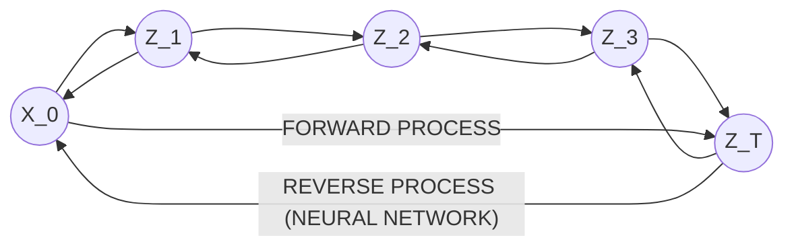

Diffusion models are generative models, which are models that learn the probability distribution of the dataset, so that we can sample from this distribution to generate new instances that has similar characteristics to the original dataset. The generative models work on modeling our data as a very big [[Joint probability distribution]] 
(of the features of the input data)and learn the parameters of these distributions to be used in sampling.
However calculation the joint distributions becomes computationally intractable, so we deploy [[Neural networks]] to learn the parameters of these distributions. After learning these distributions we can sample from them to generate new instances that are not members of the original dataset.

[[Forward process]]: take the original image + adding noise to it in steps until we reach total noise at time step T =1000. The forward process is a fixed process meaning we have analytical formula of how we add the noise at each step, but we do not have the any close formula for the reverse process. We use a neural network to learn the reverse process.

The noising process i.e forward process is define by the following formula:
$q(x_1:T|x_0):=\prod^{T}_{t=1} q(x_t| x_{t-1}) \space where , q(x_t|x_{t-1}):=N(x_t; \sqrt{1-\beta_t} x_{t-1}, \beta_t I)$
We can see that we can  $x_t$ depends only on $x_{t-1}$ which known as a Markov chain noising process.

[[Reverse process]]: The reverse process is how to reverse the noising process to get an image from pure noise, to achieve we train a neural network that learns how to remove noise from image step by step. The reverse process is defined as a Markov chain with learned Gaussian transitions starting at $p(x_T) = N(x_T;0,I)$
$p_\theta(x_0:T) := p(x_T) \prod_{t=1}^{T}p_\theta (x_{t-1} |x_t),\space  p_\theta(x_{t-1}|x_t) := N(x_{t-1}; \mu_\theta(x_t,t) \Sigma_\theta(x_t,t))$

The mean $\mu_\theta$ and the variance $\Sigma_\theta$ are not known and need to be learned through the the neural network. In practice we set the variance to be fixed. 

We want to learn the probability distribution of the original image $p_\theta(x_0) := \int{p_\theta(x_0, T)d_{x_{1}, T}}$
but we can not marginalize this as it's computationally intractable so we use a neural network to learn the parameters $\theta$ to [[maximize the likelihood ]] 
